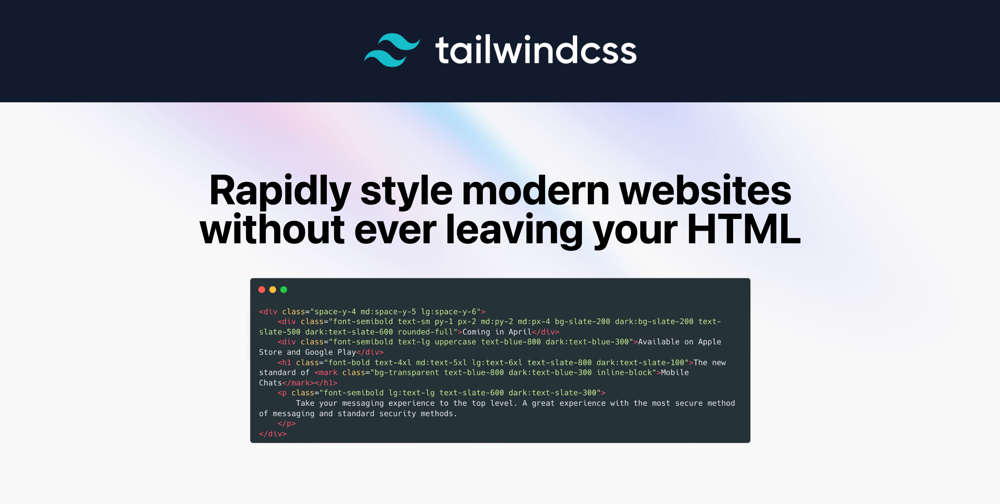

## What is Tailwind CSS?

Tailwind CSS is a utility-first CSS framework that provides a collection of pre-designed CSS classes to create user interfaces quickly. It's designed to be highly customizable, and provides a set of building blocks that can be combined to create complex layouts and designs with minimal custom CSS. All without any annoying opinionated styles you have to fight to override.

Tailwind CSS works by providing a set of utility classes that correspond to specific CSS properties, such as text color, padding, margin, and more. These classes can be applied directly to HTML elements to quickly apply the desired styles. For example, the class `bg-blue-500` can be used to set the background color of an element to a specific shade of blue.

Similar to regular CSS, there are no ready-made components provided for you. Simply, add the utility classes in your HTML, and watch how Tailwind automatically attaches the styles for you! You can think of it as shorthand for your CSS.

## Table of Contents

1. [Utility Classes](#utility-classes)
2. [Modifiers](#modifiers)
3. [Arbitrary CSS](#arbitrary-css)
4. [Configuration](#configuration)
5. [Layers](#layers)
6. [Directives](#directives)
7. [Functions](#functions)
8. [Customization](#customization)
9. [Optimization](#optimization)
10. [Links](#links)

## Utility Classes

In Tailwind CSS, utility classes are small, single-purpose classes that can be used to apply specific styles to HTML elements. These classes are named based on the CSS property they control and the value they apply.

For example, the `bg-red-500` class can be used to set the background color of an element to red. Similarly, the `text-lg` class can be used to set the font size of text to large. Utility classes can also be combined to create more complex styles without the need for custom CSS. For example, you could combine the `bg-red-500`, `text-white`, and `px-4` classes to create a red button with white text and some padding:

```HTML
<button class="bg-red-500 text-white px-4 hover:bg-red-900">Click me!</button>
```

Utility classes in Tailwind CSS follow a consistent naming convention that makes it easy to understand what each class does. The naming convention consists of several parts:

- **The first part indicates the CSS property that the class controls** (e.g. `bg` for background color, `text` for text color, `p` for padding, etc.).
- **The second part indicates the value that the class applies** (e.g. `red-500` for a specific shade of red, `lg` for large font size, `4` for 16px, etc.).
- **Additional parts may be added to modify or extend the behavior of the class** (e.g. `hover:`, `focus:`, `active:`, `dark:`, etc.).

[Back to Table of Contents](#table-of-contents)

## Utility Classes: Categories

Tailwind CSS utility classes are organized into several categories based on their functionality. These categories are:

- **Layout**: Manage layout and positioning with classes like display, float, and object-fit.
- **Flexbox & Grid**: Use Flexbox or CSS Grid for layouts with classes like flex-direction, flex-wrap, grid-template-columns, and grid-gap.
- **Spacing**: Control element spacing with classes like padding, margin, and `* + *` (lobotomized owl).
- **Sizing**: Adjust element sizing with classes like width, height, max-width, max-height, min-width, and min-height.
- **Typography**: Control typography with classes like font-size, font-weight, text-align, text-color, line-height, and text-decoration.
- **Backgrounds**: Manage element backgrounds with classes like background-color, background-image, background-size, and background-position.
- **Borders**: Control element borders with classes like border, border-radius, border-color, and border-width.
- **Effects**: Add effects like box-shadow and opacity to elements.
- **Filters**: Apply filters like blur, brightness, contrast, and grayscale to elements.
- **Tables**: Style HTML tables with table layout, border, and cell padding classes.
- **Transitions & Animations**: Add transitions (ex. transition-duration) and ready-made animations (ex. animate-spin) to elements.
- **Transforms**: Apply transforms like rotate, scale, and translate to elements.
- **Interactivity**: Enhance element interactivity with classes like cursor, caret-color, and scroll-behavior.
- **SVG**: Style SVG elements with fill or stroke color, opacity, or stroke width classes.
- **Accessibility**: Use ready-made utility classes to show elements to screen readers only or to both screen readers and sighted users.

[Back to Table of Contents](#table-of-contents)

## Modifiers

Tailwind CSS modifiers adjust the behavior or appearance of utility classes. Apply modifiers using a colon (:) followed by the modifier name. The modifier categories are:

- **Pseudo-element**: Add styles to specific parts of selected elements.
  - **Content**: Insert content with `before:` and `after:` modifiers.
  - **Style**: Apply styles using `first-line:`, `placeholder:`, `selection:`, and `backdrop:` modifiers.
- **Pseudo-class**: Add styles to selectors under certain conditions.
  - **Variants**: Apply classes based on element position or relationship with `first:`, `last:`, `even:`, and `odd:` modifiers.
  - **State**: Control appearance in different states with `hover:`, `focus:`, `valid:`, and `disabled:` modifiers.
  - **Group**: Control appearance based on parent state using `group-hover:`, `group-focus:`, and `group-active:` modifiers.
  - **Peer**: Control appearance based on sibling state with `peer-invalid:`, `peer-focus:`, `peer-required:`, and `peer-disabled:` modifiers.
- **Responsive**: Apply classes at specific screen sizes using `sm:`, `md:`, `lg:`, and `xl:` modifiers.
- **!important**: Override previously defined styles by placing `!` at the beginning of the utility name, after any variants, but before any prefix (e.g. `sm:hover:!tw-font-bold`).

[Back to Table of Contents](#table-of-contents)

## Arbitrary CSS

If you ever need to use a CSS property that Tailwind doesn’t include a utility for out of the box, you can also use square bracket notation to write completely arbitrary CSS.

- **Arbitrary values**: Use to style based off a custom value.

```HTML
<div class="top-[117px] text-[#333333]"></div>
```

- **Arbitrary properties**: Use to style based off of custom property and value.

```HTML
<div class="[mask-type:luminance]"></div>
```

[Back to Table of Contents](#table-of-contents)

## Arbitrary CSS: Modifiers

Tailwind CSS also let's you create custom selector modifiers.

- **Arbitrary variants**: Use custom variant modifier to style element based on their position within the document tree or their relationship with other elements.

```JSX
// applies an underline only to the third li
<ul>
  {[1, 2, 3, 4, 5].map((item, i) => (
    <li className="[&:nth-child(3)]:underline" key={i}>
      {item}
    </li>
  ))}
</ul>
```

- **Arbitrary groups**: Use custom `group-*` modifiers to style element based on parent state. Mark the parent with the `group` class.

```HTML
<!-- p element is hidden - can't see the word "Published" -->
<div class="group">
  <p class="hidden group-[.is-published]:block">
    Published
  </p>
</div>
```

```HTML
<!-- p element is shown - can see the word "Published" -->
<div class="group is-published">
  <p class="hidden group-[.is-published]:block">
    Published
  </p>
</div>
```

- **Arbitrary peers**: Use custom `peer-*` modifiers to style element based on sibling state. You can style an element based on the state of a sibling element. Mark the sibling with the `peer` class. Ex. This arbitrary modifier applies `block` class only when sibling has `show-sibling` class.

```HTML
<!-- 2nd p element is not shown - can see the word "First child" only -->
<div>
  <p class="peer">
    First child
  </p>
  <p class="hidden peer-[.show-sibling]:block">
    Second child
  </p>
</div>
```

```HTML
<!-- 2nd p element is shown - can see the words "First child" and "Second child" -->
<div>
  <p class="peer show-sibling">
    First child
  </p>
  <p class="hidden peer-[.show-sibling]:block">
    Second child
  </p>
</div>
```

[Back to Table of Contents](#table-of-contents)

## Resolving Ambiguities

Many utilities in Tailwind share a common namespace but map to different CSS properties. For example `text-lg` and `text-black` both share the `text-` namespace, but one is for font-size and the other is for color.

When using arbitrary values, Tailwind can generally handle this ambiguity automatically based on the value you pass in:

```HTML
<!-- Will generate a font-size utility -->
<div class="text-[22px]">...</div>

<!-- Will generate a color utility -->
<div class="text-[#327ba8]">...</div>
```

[Back to Table of Contents](#table-of-contents)

## Configuration

The `tailwind.config.js` file is a configuration file that allows you to configure and customize various aspects of your Tailwind CSS setup including defining custom colors, spacing, breakpoints, and more.

By default, the `tailwind.config.js` file exports an empty configuration object. However, you can add or override any properties you want to customize, such as colors, fonts, breakpoints, and more. You can also extend the default Tailwind CSS configuration by adding your own custom values or modifying existing ones.

Every section of the config file is optional, so you only have to specify what you’d like to change. Any missing sections will fall back to [Tailwind’s default configuration](https://github.com/tailwindlabs/tailwindcss/blob/master/stubs/config.full.js).

Once you have made changes to your `tailwind.config.js` file, you need to recompile your CSS to reflect these changes. You can do this by running the build or watch command, depending on your setup.

```Javascript
module.exports = {
  theme: {
    // Define theme - anything added here will override the entire object in the theme
    // Our theme will only have 2 colors - won't be able to access any other colors provided by Tailwind
    colors: {
      primary: {
        100: '#ebf8ff',
        200: '#bee3f8',
        300: '#90cdf4',
        400: '#63b3ed',
        500: '#4299e1',
        600: '#3182ce',
        700: '#2b6cb0',
        800: '#2c5282',
        900: '#2a4365',
      },
    gray: {
        100: '#f7fafc',
        200: '#edf2f7',
        300: '#e2e8f0',
        400: '#cbd5e0',
        500: '#a0aec0',
        600: '#718096',
        700: '#4a5568',
        800: '#2d3748',
        900: '#1a202c',
      },
    },
    // Our theme will only have 2 fonts - won't be able to access any other fonts provided by Tailwind
    fontFamily: {
      sans: ['Inter', 'sans-serif'],
      serif: ['Merriweather', 'serif'],
    },
    // The extend property is used to add/override theme values or add custom values
    extend: {
      colors: {
        darkGray: "#263238",
        stickyNoteYellow: "#ffff88",
      },
      fontSize: {
        '2xl': '1.5rem',
        '3xl': '1.875rem',
      },
      fontWeight: {
        bold: '700',
      },
      textColor: {
        gray: {
          600: '#4a5568',
          800: '#2d3748',
      },
    },
  },
  plugins: [],
}
```

[Back to Table of Contents](#table-of-contents)

## Referencing in JavaScript

It can often be useful to reference your configuration values in your own client-side JavaScript — for example to access some of your theme values when dynamically applying inline styles in a React or Vue component.

To make this easy, Tailwind provides a resolveConfig helper you can use to generate a fully merged version of your configuration object:

```JSX
import resolveConfig from "tailwindcss/resolveConfig";
import tailwindConfig from "../tailwind.config.js";

const config = resolveConfig(tailwindConfig);

console.log(config?.theme?.colors?.stickyNoteYellow);
// prints "#ffff88"
```

Note that this will transitively pull in a lot of our build-time dependencies, resulting in bigger client-side bundle size. To avoid this, we recommend using a tool like `babel-plugin-preval` to generate a static version of your configuration at build-time.

[Back to Table of Contents](#table-of-contents)

## Layers

In CSS, the order of the rules in your stylesheet decides which declaration wins when two selectors have the same specificity.

```CSS
.btn {
  background-color: blue;
}

.bg-black {
  background-color: black;
}
```

Here, both buttons will be black since `.bg-black` comes after `.btn` in the CSS:

```HTML
<button class="btn bg-black">...</button>
<button class="bg-black btn">...</button>
```

To manage this, Tailwind organizes the styles it generates into three different “layers” — a concept popularized by ITCSS.

- **The base layer** is for things like reset rules or default styles applied to plain HTML elements.
- **The components layer** is for class-based styles that you want to be able to override with utilities.
- **The utilities layer** is for small, single-purpose classes that should always take precedence over any other styles.

Being explicit about this makes it easier to understand how your styles will interact with each other. Lets you control the final declaration order while still organizing your actual code in whatever way you like.

Additionally, any custom styles you add to the base, components, or utilities layers will only be included in your compiled CSS if those styles are actually used in your HTML.

[Back to Table of Contents](#table-of-contents)

## Directives

Directives allow you to apply existing utility classes and configs to specific elements or contexts.

- **`@tailwind`**: Use the `@tailwind` directive to inject each layer's (base, components, utilities) styles into your CSS. Adding it also injects any other styles registered by plugins.

```CSS
@tailwind base;
@tailwind components;
@tailwind utilities;
```

- **`@layer`**: Use the `@layer` directive to add custom styles to a specific "layer". Any styles you add to Tailwind with `@layer` will automatically support Tailwind’s modifier syntax for handling things like hover states, responsive breakpoints, dark mode, and more.

```CSS
@tailwind base;
@tailwind components;
@tailwind utilities;

/* set default page styles (ex. body, h1, div, p) */
@layer base {
  h1 {
    @apply text-2xl;
  }
  h2 {
    @apply text-xl;
  }
}

/* create custom component styles (ex. card, btn, badge) */
@layer components {
  .card {
    background-color: theme('colors.white');
    border-radius: theme('borderRadius.lg');
    padding: theme('spacing.6');
    box-shadow: theme('boxShadow.xl');
  }
}


/* create custom utility classes */
@layer utilities {
  .content-auto {
    content-visibility: auto;
  }
}
```

```HTML
<!-- Use card component and utility classes -->
<div class="card">
  <h1>Card Title</h1>
  <h2>Card Subtitle</h2>
  <p class="content-auto">Card content</p>
</div>
```

- **`@apply`**: Allows you to apply existing utility classes to a single CSS class.

```CSS
/* Apply multiple utility classes to btn-primary class */
.btn-primary {
  @apply bg-blue-500 text-white py-2 px-4 rounded;
}
```

```HTML
<!-- Use btn-primary class -->
<a href="#" class="btn-primary">Learn More</a>
```

- **`@config`**: Specify which config file Tailwind should use when compiling that CSS file. This is useful for projects that need to use different configuration files for different CSS entry points. Put the @config directive after @import statements.

```CSS
@import url("https://fonts.googleapis.com/css2?family=Courier+Prime:ital,wght@0,400;0,700;1,400;1,700&display=swap");

@config "./tailwind.site.config.js";
```

[Back to Table of Contents](#table-of-contents)

## Functions

Your theme and customizations in `tailwind.config.js`, can be accessed through Tailwind functions.

- **`theme()`**: This function allows you to access and modify the default values of the theme in the `tailwind.config.js`, such as colors or font sizes.

```CSS
/* Use dot notation to access values */
.big-text {
  font-size: theme("fontSize.2xl");
}

/* To adjust the opacity of a color retrieved with theme, use a slash followed by the opacity value you want to use */
.btn-blue {
  background-color: theme("colors.blue.500 / 75%");
}

/* If you need to access a value that contains a dot (like the 2.5 value in the spacing scale), you can use square bracket notation */
.content-area {
  height: calc(100vh - theme("spacing[2.5]"));
}
```

- **`screen()`**: This function allows you to create media queries that reference your breakpoints by name instead of duplicating their values in your own CSS.

```CSS
@media screen(sm) {
  /* ... */
}
```

[Back to Table of Contents](#table-of-contents)

## Customization

In addition to using the `tailwind.config.js` file, functions, and directives, there are several other ways to customize Tailwind CSS:

- **Using plugins**: Tailwind CSS has an extensive plugin system that allows you to add new utility classes, components, and themes to your project. You can find many plugins on the official Tailwind CSS website, or you can create your own. Tailwind CSS also provides an API for creating and using plugins that extend the framework's functionality.
- **Using pre-built themes**: There are many pre-built Tailwind CSS themes available online that you can use to quickly change the look and feel of your website.
- **Using CSS-in-JS libraries**: If you prefer to write your CSS in JavaScript, you can use CSS-in-JS libraries like styled-components or emotion to create custom styles that integrate with Tailwind CSS.
- **Using CSS preprocessors**: Tailwind CSS supports CSS preprocessors like Sass and Less, which allow you to write more advanced CSS and take advantage of features like variables and mixins.
- **Manually adding custom CSS**: If you need to add custom CSS that is not supported by Tailwind CSS, you can do so by adding it to your HTML file or using a separate CSS file. However, this method should be used sparingly and only for specific cases where other customization options are not available.

[Back to Table of Contents](#table-of-contents)

## Optimization

Optimization is important in Tailwind CSS because it helps to reduce the size of the final CSS file. This in turn makes the page load quicker, improves code readability and maintainability, and reduces the risk of conflicts or error in the CSS code.

- **Use customization**: Tailwind CSS allows for a lot of customization through the `tailwind.config.js` file. It's important to use this customization instead of directly adding styles to the project's CSS files to ensure that the custom styles are consistent with the rest of the project.
- **Use `@apply` directive**: This directive lets you group multiple classes together and apply them to a single element. This can help reduce the amount of CSS you need to write and make your code more maintainable.
- **Use the `@layer` directive**: This directive allows you to organize your CSS code into "layers", which can improve the readability and maintainability of your code.
- **Create reusable components**: Instead of repeating the same combination of utility classes in multiple places, you can create reusable components that contain the necessary styles. For example, if you have a button that appears in multiple places, you can create a Button component that contains the necessary utility classes. This way, you can avoid duplicating code and ensure that your styles are consistent across your project.
- **Use shorthand classes**: Tailwind provides several shorthand classes that let you apply multiple styles to a single element. For example, instead of writing `pt-4 pb-4 pr-4 pl-4`, you can write `p-4`.
- **Use responsive classes selectively**: Tailwind provides a set of responsive classes that let you apply styles based on the screen size. However, it's important to use these classes selectively and only apply the styles that are needed for each breakpoint. This can help keep your CSS file size down.
- **Purge unused styles**: By default, Tailwind includes a lot of classes that you may not need in your project. You can remove these unused classes by running the purge command during your build process. This will analyze your code and remove any unused classes from your CSS file.
- **Use JIT mode**: Tailwind's just-in-time (JIT) mode generates styles on the fly as they are needed, which can help reduce the size of your CSS file. To use JIT mode, set mode: 'jit' in your Tailwind configuration file.
<!-- - **Use a design system**: A design system is a set of guidelines, components, and assets that define the visual language of a project. By using a design system, you can ensure that your styles are consistent across your project and avoid repeating common utility combinations. Tailwind CSS can be a great foundation for building a design system because of its utility-based approach. -->

[Back to Table of Contents](#table-of-contents)

## Links

Tailwind CSS 101

- Codepen: [Styled with Regular CSS](https://codepen.io/mexicode/pen/ZEMXJKP)
- Codepen: [Styled with Tailwind CSS](https://codepen.io/mexicode/pen/ZEMXpYm)
- Github: [Styled with Tailwind CSS + Optimization](https://tailwind-css-101.vercel.app/) (source code is in this repository)

Accordion Interactive Demo

- Codepen: [Start](https://codepen.io/mexicode/pen/LYJdoPa)
- Codepen: [End](https://codepen.io/mexicode/pen/BaOObOW)

Additional Links

- Tailwind CSS [Docs](https://tailwindcss.com/)
- Tailwind CSS [Cheatsheet](https://flowbite.com/tools/tailwind-cheat-sheet/)
- Tailwind CSS [VSCode Intellisense Extension](https://marketplace.visualstudio.com/items?itemName=bradlc.vscode-tailwindcss)

[Back to Table of Contents](#table-of-contents)
